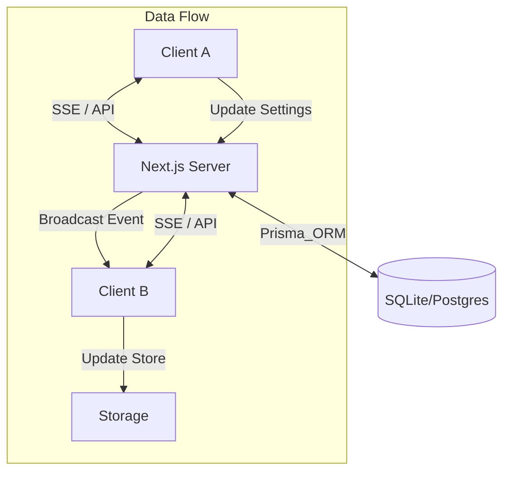

# Chaster - 时间锁加密内容保护应用

基于**时间锁加密技术 (Timelock Encryption)** 和 **drand 去中心化随机信标网络**的内容保护应用客户端。

## ✨ 核心特性

- 🔐 **真正的强制时间锁**：基于密码学，无法提前解密
- 🌐 **远程加密服务**：调用独立的加密 API 服务
- 🔄 **多层加密**：支持延长锁定时间
- 📱 **全平台响应式**：完美适配桌面和移动设备
- 🎨 **现代化 UI**：
  - 支持浅色/深色/系统跟随模式
  - 可自定义主题色
  - 优雅的毛玻璃效果与动画交互
- 🌍 **国际化支持**：完整的中英文界面 (i18n)
- 📊 **仪表盘统计**：可视化展示加密数据统计
- 🛡️ **隐私保护**：隐私模式模糊敏感内容
- 💾 **本地持久化**：自定义缓存策略与数据持久化
- 🔄 **多端同步**：基于 SSE 的实时状态同步与会话追踪
- 🔍 **高级筛选与搜索**：支持模糊搜索、时间范围筛选及常用预设保存
- 🎉 **解锁特效**：解锁时刻的庆祝动画与音效

## 🏗️ 架构说明

### 多端同步架构 (Multi-Device Sync)



**同步特性**:
- **实时性**: 设置变更毫秒级同步到所有设备
- **会话追踪**: 实时显示当前有多少人正在查看同一内容
- **双写策略**: 本地优先 + 云端同步，保证极致响应速度
- **隐私设计**: 基于设备指纹识别，无强制账户体系

### 原有架构（基于远程 API）

```
前端 UI (Next.js)
    ↓
本地 API Routes (代理层)
    ↓
远程加密服务 API
    ↓
时间锁加密 + drand 网络
```

**特点**:
- 前端代码与原来完全兼容
- 后端 API Routes 作为代理层
- Token 安全存储在服务端
- 加密逻辑由远程服务处理
- 状态管理采用 Zustand + React Query

## 🚀 快速开始

### 1. 环境配置

创建 `.env.local` 文件：

```bash
# 远程加密服务配置
CHASTER_API_URL=http://localhost:3000/api/v1
CHASTER_API_TOKEN=tok_your_token_here
```

> **获取 Token**: 在加密服务端运行 `npm run token` 创建新的 API token

### 2. 安装依赖

```bash
npm install
```

### 3. 启动开发服务器

```bash
npm run dev
```

访问 `http://localhost:3001`（如果 3000 端口被占用）

### 4. 生产构建

```bash
npm run build
npm start
```

## 🐳 生产环境部署 (Production Deployment)

本项目的生产环境部署基于 Docker Compose 和 GitHub Container Registry (GHCR)。

### 1. 准备配置文件

在服务器目录中创建 `docker-compose.yml` (可以使用项目中的 `docker-compose.prod.yml`) 和 `.env` 文件。

**.env 示例**:

```ini
# API Token (必须与 chaster 服务一致)
API_TOKEN=your_secure_random_token_here

# 数据库 URL (如果使用外部数据库)
# DATABASE_URL="postgresql://..."
```

### 2. 启动服务

使用 Docker Compose 拉取镜像并启动服务：

```bash
docker compose -f docker-compose.prod.yml up -d
```

这将自动从 `ghcr.io/xiangyumou/promissum:latest` 拉取最新的生产镜像并启动应用。

### 3. 更新镜像

当有新版本发布时，执行以下命令更新：

```bash
docker compose -f docker-compose.prod.yml pull
docker compose -f docker-compose.prod.yml up -d
```

## 🧪 Testing

The project has comprehensive unit test coverage using Vitest.

### Run Tests

```bash
# Run all tests
npm test

# Run tests with coverage report
npm run test:coverage

# Run tests in watch mode
npm test -- --watch
```

### Test Coverage

- **Overall Coverage**: ~66% code coverage
- **97 Unit Tests** covering:
  - ✅ All lib utilities and services
  - ✅ All custom React hooks
  - ✅ Major UI components
  - ✅ Edge cases and error handling

### Test Structure

```
src/test/
├── components/        # Component tests (AddModal, Dashboard, etc.)
├── unit/
│   ├── hooks/         # Custom hooks tests
│   └── lib/           # Utility library tests
└── utils.tsx          # Test utilities and providers
```

## 📚 技术栈

- **前端框架**：Next.js 16 + React 19
- **语言**：TypeScript 5
- **样式**：Tailwind CSS 4
- **状态管理**：Zustand 5
- **数据获取**：React Query 5 (TanStack Query)
- **UI 组件**：Radix UI (Dialog, Slot), Framer Motion
- **工具库**：
  - `date-fns`: 日期格式化
  - `zod`: 数据验证
  - `react-use`: 常用 Hooks
  - `next-intl`: 国际化
  - `yet-another-react-lightbox`: 图片预览

## 📖 文档

- [产品需求文档 (PRD)](docs/PRD.md) - 完整的产品规格说明
- [API 参考文档](docs/API_REFERENCE.md) - 远程加密服务 API 说明
- [架构迁移指南](docs/MIGRATION_GUIDE.md) - 数据库迁移说明

## 🔒 安全性

- **Token 保护**：API Token 存储在服务端环境变量
- **代理模式**：前端不直接暴露 Token
- **加密强度**：使用 BLS12-381 曲线的 IBE (Identity-Based Encryption)
- **去中心化**：依赖 drand 网络，无单点故障

## 🛣️ 功能状态

### 已完成
- ✅ 文本/图片时间锁加密
- ✅ 双模式时间设定（持续时长/绝对时间）
- ✅ 实时倒计时与自动解锁
- ✅ 延长锁定功能（多层加密）
- ✅ 响应式移动端适配
- ✅ 远程 API 服务集成
- ✅ 仪表盘统计视图
- ✅ 完整设置页面 (偏好/主题/安全)
- ✅ 深色模式与主题自定义
- ✅ 国际化 (中/英)
- ✅ 数据导出功能

### 规划中
- 🔮 批量操作功能
- 🔮 通知提醒系统
- 🔮 多用户账号系统

## 🔧 开发说明

### 项目结构

```
├── src/
│   ├── app/
│   │   ├── [locale]/     # 国际化路由页面
│   │   ├── api/          # API Routes (代理层)
│   │   └── globals.css   # 全局样式
│   ├── components/       # UI 组件
│   │   ├── ui/           # 基础 UI 组件 (Button, Input等)
│   │   ├── AddModal.tsx  # 创建项目弹窗
│   │   ├── Sidebar.tsx   # 侧边栏
│   │   └── ...
│   ├── lib/
│   │   ├── stores/       # Zustand 状态存储
│   │   ├── api-client.ts # API 客户端封装
│   │   └── queries.ts    # React Query 查询
│   ├── hooks/            # 自定义 Hooks
│   ├── i18n/             # 国际化配置
│   └── messages/         # 翻译文件 (en.json, zh.json)
├── docs/                 # 项目文档
└── public/               # 静态资源
```

## 📄 许可证

MIT License

---

**更新时间**：2025-12-28
**版本**：v0.3.0 (Feature Complete)
